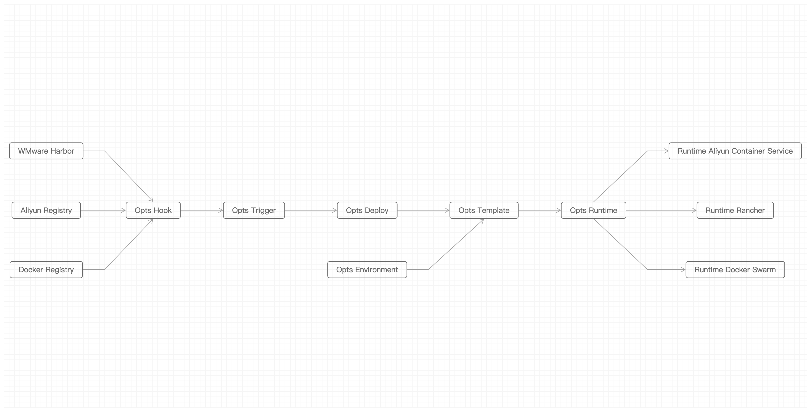

> DevOps Middleware based on Aliyun Container Service / Docker Service

## Feature

**镜像仓库管理**

- 共有仓库
	- aliyun docker registry
	- docker hub
- 私有仓库 
	- Aliyun Docker Registry
	- WMware Harbor 
	- Docker Registry

**容器服务管理**

- aliyun container service
- rancher (WIP)
- docker swarm (WIP)
- kubernetes (WIP)

## Architecture

## Usage

## Reference

- https://github.com/thonatos/opts-react
- https://github.com/thonatos/opts-egg
